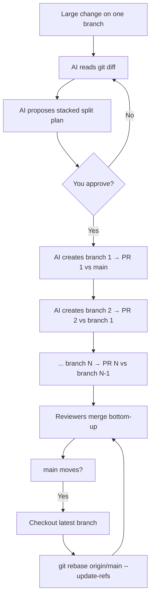

# Leveraging LLM to Split Large Changes into Stacked PRs

LLMs often produce large changes — hundreds or thousands of lines on a single branch. Reviewing that as one PR is slow and risky. Splitting it into small, reviewable PRs by hand is correct, but tedious: you must decide what goes in each slice, create branches, and keep them in sync every time `main` moves.

This guide covers the common case: **the large change already exists** (visible in `git diff`). You ask the AI to split it into a **stack of branches**, where each branch becomes one PR. Stack maintenance is a single rebase from the top branch using `git rebase --update-refs`.

For splitting principles (size targets, logical units, CI per PR), see [Planning Small PRs](./context-planning-small-prs.md).

---

## The Core Idea

You already have the work — on one branch, often with uncommitted changes. The AI's job is to:

1. **Read the diff** against `main` and propose logical slices.
2. **Create stacked branches** — each branch builds on the one below it; each becomes one PR.
3. **Keep one linear stack** — when `main` moves, check out the **latest branch** and run one rebase command; Git updates every branch ref in the stack.



---

## What a Stack Looks Like

A stack is a **chain of branches**. Each branch tip is a commit that the next branch builds on. PRs target the branch below, not always `main`.

Example from a real feature (Custom Table Phase 10):

```text
main
 └── f/#17196-0-ctp10-db-migration              PR #1  (base: main)
      └── f/#17196-1a-ctp10-refactor-validator  PR #2  (base: 0)
           └── f/#17196-1b-ctp10-refactor-modifier   PR #3  (base: 1a)
                └── f/#17196-2-ctp10-type3-historical-validator-modifier  PR #4  (base: 1b)
                     └── ...
                          └── f/#17196-z-ctp10-update-docs   PR #15 (base: 7c)
```

**Branch naming convention** — encode ticket, order, and slug so the stack is readable:

```text
f/ or e/ or b/ + <prefix>-<index>-<slug>
```

Use numeric or letter indices (`0`, `1a`, `1b`, `2`, …) to preserve order. The **latest branch** (top of stack) contains every commit from all branches below it.

---

## Step 1 — Snapshot Your Work

Before splitting, save a recoverable backup. The large change may be committed, uncommitted, or both.

```bash
SHA=$(git stash create "pre-split")
if [ -n "$SHA" ]; then
  git update-ref "refs/backup/pre-split-$(date +%s)" "$SHA"
fi
```

Do not use destructive git commands (`reset --hard`, `clean -fdx`, branch deletion) unless you explicitly intend to.

---

## Step 2 — Ask the AI to Split the Diff

Point the AI at your current state. In Cursor, reference the branch or ask it to run `git diff main...HEAD` (and include uncommitted changes if any).

### Starter prompt

```text
I have a large change that needs to be split into small stacked PRs.

1. Compare my current work to main (committed + uncommitted).
2. Propose a stacked split following @context-planning-small-prs.md

For each branch/PR provide:
- Branch name: f/ or e/ or b/ + <prefix>-<index>-<slug>
- PR title
- One-sentence purpose
- Files or paths in this slice
- Base branch (main for the first; previous branch for the rest)
- Commit order within the stack

Show the stack as a diagram. Do NOT run git commands yet — plan only.
```

Review the plan. Merge slices that are too thin, split slices that are too large, and reorder if dependencies are wrong.

### Execute prompt (after you approve)

```text
Execute the approved split plan. For each branch in order:
1. Create the branch from its base
2. Stage ONLY the files for this slice (never git add .)
3. Commit with a clear message
4. Push and open a PR targeting the base branch

Start from the bottom of the stack (branch targeting main) and work up.
Save a backup ref before starting.
```

---

## Step 3 — One Branch Becomes One PR

After the split, you have N branches and N open PRs:

| Branch | PR targets | Contains |
|--------|------------|----------|
| `f/#17196-0-ctp10-db-migration` | `main` | DB migration only |
| `f/#17196-1a-ctp10-refactor-validator` | `0` | Refactor + everything in `0` |
| `f/#17196-1b-ctp10-refactor-modifier` | `1a` | Modifier changes + everything below |
| … | … | … |
| `f/#17196-z-ctp10-update-docs` | `7c` | Docs + entire stack below |

Reviewers see **only the diff between a branch and its base** — a small, focused change. They merge **bottom-up**: merge PR #1 first, then retarget or merge PR #2, and so on.

---

## Step 4 — Maintain the Stack with `git rebase --update-refs`

When `main` moves, you do **not** rebase each branch one by one. Keep one linear stack and rebase from the top.

### Why checkout only the latest branch?

The latest branch (top of stack) contains the full commit history of every branch below it. When you rebase it onto `main`, Git replays all commits in the stack. With `--update-refs`, Git also moves every intermediate branch ref (`0`, `1a`, `1b`, …) to point at the correct new commits.

You never need to checkout `f/#17196-0`, `f/#17196-1a`, etc. individually for rebasing.

### The recipe (Git 2.38+)

```bash
git fetch origin

# Checkout ONLY the latest branch in the stack
git checkout f/#17196-z-ctp10-update-docs

# One command rebases the entire stack and updates all branch refs
git rebase origin/main --update-refs
```

After this, every branch in the stack points at the rebased commits:

```text
Before rebase:
  main ─── A
  f/#17196-0 ─── B          (was based on old main)
  f/#17196-1a ─── C         (was based on B)
  ...
  f/#17196-z ─── Z          (was based on Y)

After git rebase origin/main --update-refs (from f/#17196-z):
  main ─── A ─── A'         (new commits from main)
  f/#17196-0 ─── B'         (updated automatically)
  f/#17196-1a ─── C'        (updated automatically)
  ...
  f/#17196-z ─── Z'         (you checked this one out)
```

### Push the updated stack

Rebase rewrites history, so force-push each branch. Our GitHub restricts at most **2 branch updates per push**:

```bash
git push -f -u origin \
  'f/#17196-0-ctp10-db-migration' \
  'f/#17196-1a-ctp10-refactor-validator'

git push -f -u origin \
  'f/#17196-1b-ctp10-refactor-modifier' \
  'f/#17196-2-ctp10-type3-historical-validator-modifier'

# ... continue in pairs until all branches are pushed

git push -f -u origin \
  'f/#17196-7c-ctp10-fix-migration' \
  'f/#17196-z-ctp10-update-docs'
```

Or ask the AI to generate the push commands for your specific branch list.

### Requirements

- **Linear stack** — each branch tip must be an ancestor of the next. No branch forks off `main` independently within the same stack.
- **Git 2.38+** — for `--update-refs`. Check with `git --version`.
- **Branch refs only point at stack commits** — do not reuse a stack branch for unrelated work.

### If rebase conflicts

Fix conflicts on the current (latest) branch, then:

```bash
git rebase --continue
```

Git continues replaying commits; `--update-refs` keeps lower branches aligned. If `main` moved again mid-rebase, finish the current rebase first, then rerun the same two commands (`fetch` + `rebase --update-refs`).

---

## Splitting Strategies (Quick Reference)

When refining the AI's plan, use these heuristics:

| Strategy | Example stack |
|----------|----------------|
| **By layer** | migration → service → API → UI |
| **By behavior** | create flow → update flow → delete flow |
| **Refactor first** | pure refactor (zero behavior change) → feature on top |
| **Interface first** | contract + mocked tests → concrete implementation |
| **Mechanical isolation** | dependency bump / formatting → logic changes |

Full rationale: [Planning Small PRs](./context-planning-small-prs.md).

---

## Prompt Library

### Initial split request

```text
Split my current diff against main into stacked branches. Each branch
becomes one PR. Follow Planning Small PRs rules. Show branch names,
base branches, and files per slice. Plan only — do not execute yet.
```

### Refine an oversized slice

```text
Branch f/#17196-2 in your plan is ~800 lines. Split it into two
stacked branches that each deliver one reviewable behavior.
Keep tests with the behavior they cover.
```

### Isolate a refactor from the diff

```text
From my diff, pull all refactor-only changes (moves, renames,
zero behavior change) into the first branch. Feature logic starts
in branch 2.
```

### Generate rebase + push commands

```text
My stack branches are:
[paste branch list in order]

Generate the exact git commands to rebase the stack onto origin/main
using --update-refs and force-push all branches (2 per push).
```

### Recover from a bad split

```text
The split went wrong. Here is git branch -v and git log --oneline.
Help me recover using refs/backup/pre-split-* without losing work.
```

---

## Common Mistakes

| Mistake | Better approach |
|---------|-----------------|
| Manually rebasing every branch when `main` moves | Checkout **latest branch only**; `git rebase origin/main --update-refs` |
| `git add .` when creating a slice | Stage named files or hunks only |
| Splitting at 300 lines arbitrarily | Split by **logical unit**; 300 lines is a guide |
| Deferring all tests to the last PR | Each branch/PR carries its own tests |
| Breaking the linear chain (branch targets `main` mid-stack) | Every branch after the first targets the branch directly below |
| Merging PRs out of order | Merge bottom-up |
| Forgetting to force-push after rebase | Push all stack branches with `--force-with-lease` |

---

## Checklist

**Split**

- [ ] Backup ref saved before splitting
- [ ] AI split plan reviewed and approved
- [ ] Branches created bottom-up; each PR targets the branch below
- [ ] Each PR compiles, passes CI, and is reviewable in ~1 hour

**Maintain**

- [ ] Stack is linear; branch names encode ticket + order
- [ ] On `main` update: `git fetch` → checkout **latest branch** → `git rebase origin/main --update-refs`
- [ ] Force-push all branches (2 per push on GitHub)
- [ ] Re-check CI on the bottom PR

---

## Summary

| Step | What happens |
|------|----------------|
| **Split** | AI reads your large diff, proposes stacked branches, creates one PR per branch |
| **Review** | Reviewers see small diffs; merge bottom-up |
| **Maintain** | Checkout the latest branch → `git rebase origin/main --update-refs` → force-push |

The AI handles the tedious part — analyzing a giant diff and carving it into branches. You approve the plan and keep one linear stack. Rebasing the whole stack is two commands plus push, not one manual rebase per branch.
